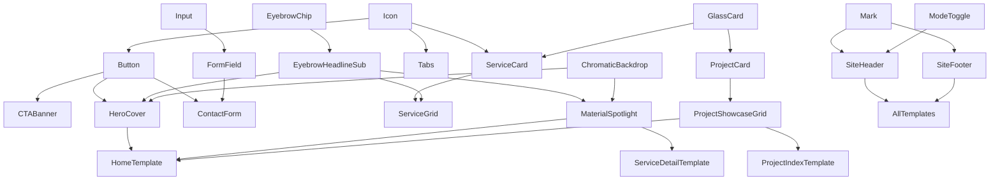

# 04 — Component Architecture

**From tokens to components. What we build, what we take from shadcn/ui, what we customize, what we make bespoke. Atomic Design methodology.**

*Reads after `03_DESIGN_SYSTEM.md`.*

---

## 0. Scope and method

This document is the **component contract** for the design crew and downstream developers. For each component:

- Its anatomy (parts).
- Its variants and states.
- Its sizing and tokens used.
- Its content rules.
- Its dual-mode treatment (where mode matters).
- Its shadcn/ui relationship (as-is, mapped, customized, or bespoke).

No code. Implementation chosen at production time. Every implementation must satisfy the contract here.

---

## 1. Atomic Design — the organization

We use **Brad Frost's Atomic Design**. Five levels.

| Level | Definition | Example |
|---|---|---|
| **Atom** | The smallest functional unit. Cannot be decomposed further without losing meaning. | Button, Input, Icon |
| **Molecule** | A combination of 2-5 atoms doing one job. | Form field (label + input + helper) |
| **Organism** | A complete UI section with clear purpose. | Site header, Hero |
| **Template** | A page-level architecture organizing organisms. | Home template |
| **Page** | A specific instance of a template with real content. | `/projects/sani-marina-2024` |

**Distinction rule**: if it works in any context, it's an atom or molecule. If it requires known context to make sense, it's an organism. If it defines page structure, it's a template.

---

## 2. Relationship to shadcn/ui and Lucide

### 2.1 Why shadcn/ui

We use shadcn/ui as the foundation library. Reasons:

- **Code ownership**: shadcn copies code into the project (via CLI), not as an installed dependency. We own and modify.
- **Radix primitives underneath**: accessibility-grade focus management, keyboard interaction, screen reader support.
- **Tailwind-native**: matches the stack.
- **Token-friendly**: design tokens map to CSS custom properties, which shadcn respects automatically.
- **Aesthetic-neutral default**: shadcn's defaults are unopinionated; customization is a first-class concern.

### 2.2 Four tiers of customization

For each shadcn component we use:

| Tier | Name | Meaning |
|---|---|---|
| **A — As is** | Default styling + behavior fits us. No changes. |
| **B — Token mapping** | Functionally fine, but mapped to our tokens (color, type, spacing). |
| **C — Customized** | Token mapping + structural changes (variants, anatomy, spacing). |
| **D — Bespoke** | shadcn doesn't have it or doesn't fit. Built from scratch (often with Radix primitives). |

Detailed customization table in **Section 11**.

### 2.3 Lucide icons policy

- **Default**: all icons from Lucide.
- **Replace with custom**: only when a Lucide icon doesn't communicate the brand-specific concept (e.g., custom paint-can or paint-swirl marks).
- **Bespoke icons** for paint-specific concepts: see Section 12.

---

## 3. Atoms — the indivisible elements

### 3.1 Button
**Tier**: C — customized.

**Anatomy**: container + (optional leading icon) + label + (optional trailing icon).

**Variants**:
| Variant | Use | Visual (light / dark) |
|---|---|---|
| `primary` | Primary CTAs | Petrol bg, white text / Petrol-soft bg, ink text |
| `secondary` | Secondary CTAs of equal intensity | Ink bg, white text / White bg, ink text |
| `outline` | Hero alternates | Transparent bg, ink/white border + text |
| `ghost` | Tertiary, navigation | No bg/border, ink/white text, hover bg subtle |
| `link` | Inline | Underlined text, no padding |

**Sizes**: sm (36px), md (48px default), lg (56px). Padding-X: 16/24/32, weight 500.

**States**: rest, hover, active, focus-visible, disabled, loading.

**Don't**: gradients, drop-shadows (except focus ring), rounded-full (radius max 6px), icon-only without aria-label.

### 3.2 Link
**Tier**: B — token mapping.

**Variants**: inline (underline, text color), standalone (brand color, no underline at rest), quiet (tertiary text).

### 3.3 Input
**Tier**: C — customized.

**Anatomy**: container with optional leading icon + input + optional trailing icon/action.

**States**: rest, focus, filled, error, disabled.

**Visual**:
- Light mode: 1px border default, 2px brand outline on focus, error border on error.
- Dark mode: 1px white-10% border, 2px brand outline on focus, glass-card-style background option.
- Border-radius 6-8px.

### 3.4 Checkbox / Radio / Toggle
**Tier**: B — token mapping (shadcn defaults work).

**Customizations**: brand color for selected state, brand focus ring, 20×20 default.

### 3.5 Badge / Chip
**Tier**: D — bespoke.

**Variants**:
- `eyebrow-stamp`: UPPERCASE, type/body/xs, +0.06em letter-spacing, ink/white text, no bg, sometimes with leading short rule.
- `pill`: rounded-full, semi-transparent bg with hairline border. The DRAVART-style chip ("PREMIUM QUALITY OIL PAINT" reference). Used for hero eyebrow labels.
- `category`: small pill with border, neutral colors, 14px text.
- `accent`: solid bg from accent palette, white text. Used for project category indicators.

### 3.6 Avatar
**Tier**: A — as is.

**Use**: testimonials (rare), team members (rare).

### 3.7 Divider / Rule
**Tier**: D — bespoke.

**Variants**: subtle (1px subtle), default (1px default), accent-petrol-short (2px brand, 60-80px), accent-petrol-full (1px brand, full width — rare and dramatic).

### 3.8 Icon
**Tier**: B — token mapping (Lucide direct).

**Sizes**: xs/sm/md/lg/xl/2xl per design system.

### 3.9 Mark (logo droplet)
**Tier**: D — bespoke.

**Versions per mode**:
- Light mode: solid petrol on white (default), ink mono.
- Dark mode: solid petrol-soft on dark, white mono, optional petrol glow halo for hero moments.

### 3.10 Color swatch
**Tier**: D — bespoke. For service / educational pages.

**Anatomy**: square block + label + sub-label (hex/Pantone optional).

### 3.11 Loader (Petrol Drop)
**Tier**: D — bespoke (signature element).

**Visual**: small petrol droplet shape pulsing (opacity 0.4 ↔ 1.0) over `motion/dur/calm`. Replaces generic spinner. Branded micro-experience.

**Sizes**: 16, 24, 32.

---

## 4. Molecules

### 4.1 Form field
**Composition**: Label atom + Input atom + Helper text atom + (Error message conditional).

**Vertical anatomy**: label → 8px → input → 8px → helper/error.

**Variants**: default, required (label has `*`), optional (label has "(optional)" suffix in tertiary text).

### 4.2 Card (basic)
**Composition**: container + optional header + body + optional footer.

**Variants**:
- `default`: solid surface (raised in dark, raised/sunken in light).
- `glass`: glass-morphism treatment. Dark mode primary use.
- `bordered`: white/raised + 1px border.
- `flat`: no border, no surface — structured content only.

**Padding**: 24px default (`space/5`).

**States**: rest, hover (subtle lift or glow intensification), focus (when interactive), active.

### 4.3 Project card
**Composition**: photo + category badge + headline + meta-line + optional CTA arrow.

**Vertical anatomy**:
```
[ Photo, 4:5 aspect, full width ]
[ Year · Category eyebrow ]                ← gap space/4
[ Project headline, type/heading/lg ]      ← gap space/2
[ One-line description, body/md, max 2 lines ] ← gap space/2
[ "Learn more →" link atom ]               ← gap space/4
```

**Variants**:
- `default`: photo top, content bottom.
- `horizontal`: photo left, content right.
- `featured`: larger size, optional petrol accent overlay.

**Hover**: image subtle scale (1.02), arrow nudges right, in dark mode a petrol border-glow intensifies.

### 4.4 Service card
**Composition**: Icon (large, brand color) + title + body + CTA link.

**Anatomy**:
```
[ Icon, icon/xl, brand ]
[ Service title, type/heading/md ]    ← gap space/4
[ Service body, type/body/sm, 2-3 lines ] ← gap space/2
[ CTA link "Learn more →" ]           ← gap space/4
```

**Variants**: `default`, `prominent` (with petrol accent border-top), `glass` (glass-morphism in dark mode).

### 4.5 Article card
**Composition**: optional thumbnail + category eyebrow + headline + excerpt + meta (date, reading time).

### 4.6 Breadcrumb
**Tier**: B — shadcn breadcrumb with token mapping.

### 4.7 Tabs
**Tier**: A — shadcn Tabs with petrol indicator (2px underline on active).

### 4.8 Accordion item
**Tier**: B — shadcn Accordion with token mapping.

**Customization**: trigger icon Lucide `plus`/`minus` rotating; open state subtle warm bg in light mode, glass card in dark mode.

### 4.9 Search field
**Composition**: Input atom with leading search icon + clear-action trailing icon.

### 4.10 Pagination
**Tier**: B — token mapping.

### 4.11 Tooltip
**Tier**: A — shadcn Tooltip with token mapping (ink bg in light mode, white bg in dark mode, body/xs text).

### 4.12 Eyebrow + Headline + Sub combo
**Composition**: Eyebrow chip + headline + optional subtitle + optional accent rule.

**Anatomy**:
```
[ EYEBROW UPPERCASE PILL ]    ← type/body/xs +500 +letter-spacing, brand or text-secondary
[ Headline ]                  ← type/heading/xl - display/md, weight 700-900
[ Subtitle (optional) ]       ← type/body/lg, weight 400, secondary, italic optional
[ Accent rule (optional) ]    ← 2px brand, 60-80px, gap space/4 above
```

**Variants**:
- `hero` (display/lg headline, all elements present)
- `section` (heading/xl headline, no rule)
- `card` (heading/md headline, no eyebrow)
- `inline` (heading/lg, eyebrow only)

This is the most-recurring section pattern across the entire site.

### 4.13 Mixed-weight headline (signature device)
**Composition**: headline split across multiple tspans/spans with varying weight + style.

**Pattern**:
```
[ Heavy headline opener ]      ← weight 900, primary color
[ Light italic phrase ]        ← weight 300 italic, brand color
```

Used in hero sections, major brand statements, editorial pull quotes.

---

## 5. Organisms

### 5.1 Site header / Navigation

**Composition**: Logo lockup + nav links + utility (phone CTA, mode toggle, IG link).

**Layout (desktop)**:
```
[ LOGO + wordmark ]   [ Projects · Services · About · Insights ]   [ TEL · MODE · IG ]
```

**Layout (mobile)**:
```
[ LOGO ]                                              [ TEL ] [ MODE ] [ ☰ ]
```

**Behavior**:
- Sticky with backdrop blur on scroll (subtle: `backdrop-filter: blur(8px) + 95% canvas opacity`).
- After scrolling past hero, height reduces by ~30%.
- Mobile menu: full-screen overlay, ink/white background per mode, large nav links, smooth crossfade.
- Mode toggle: visible icon (sun/moon Lucide), explicit click toggles, animated crossfade.

**Don't**: mega-menu dropdowns, sign-in / cart, notification badges.

### 5.2 Hero (3 variants)

#### 5.2.1 `hero/cover` — Home only
The signature hero. DRAVART-aligned aesthetic. Asymmetric. Pigment-in-motion photography as centerpiece.

**Composition**: pill chip eyebrow + mixed-weight headline + sub + dual CTA + hero photo.

**Layout**:
```
[ pill chip eyebrow ]
[ Heavy headline opener ]
[ Light italic phrase ]
[ Sub-text 2 lines ]
[ Primary CTA pill button ]
[ Hero photo full-bleed below or to right ]
```

The headline-and-photo composition mirrors the DRAVART hero structure. Photo is paint-in-motion (Mode A from `02_VISUAL_DIRECTION.md` Section 4).

In dark mode: full theatrical effect — dark canvas, luminous photo, petrol accents, ambient color forms drifting at 15-30% opacity behind.

In light mode: bright canvas, vivid photo with white surround, petrol accents, ambient color forms as soft watercolor stains at 5-15% opacity.

**Vertical padding**: `space/11` top, `space/10` bottom.

#### 5.2.2 `hero/page` — interior pages
Compact. Eyebrow + Headline + Sub + (optional secondary CTA).

**Layout**: full-width, content max-width medium, left-aligned.

**Type**: display/md headline.

**Vertical padding**: `space/9` top, `space/8` bottom.

#### 5.2.3 `hero/content` — single project, single article
Image-led. Photo as anchor.

**Layout**: 16:9 or 21:9 hero photo, content below in container.

### 5.3 Project showcase grid

**Composition**: optional filter chips + grid of Project cards.

**Layout**: 12-col, 4-col cards (3-up) desktop, 6-col (2-up) tablet, 12-col (1-up) mobile.

**Variants**:
- `editorial`: alternating layout (project 1 left 7-cols, project 2 right 5-cols, project 3 center 8-cols, etc) for home featured projects.
- `grid`: uniform 3-up grid for projects index.

### 5.4 Project case study layout

**Composition**: hero + tech-grid + body + photo gallery + related projects + CTA banner.

**Anatomy**:
```
[ Hero photo full-bleed 16:9 ]
[ Container (max-width 800px, centered) ]
  [ Eyebrow: PROJECT · YEAR · CATEGORY ]
  [ Project headline display/md ]
  [ Tech grid: substrate / system / products / location / year — 4-5 column grid ]
  [ Body editorial paragraphs ]
  [ Photo gallery — 2-3 detail shots ]
[ Related projects organism ]
[ CTA banner ]
```

**The tech grid is critical** for material quality communication. It's where we say *exactly* what we used and how.

### 5.5 Service grid

**Composition**: section header (eyebrow+headline+sub) + 6 service cards.

**Layout**: 12-col, 4-col cards (3-up) desktop, 6 (2-up) tablet, 12 (1-up) mobile.

### 5.6 Article reading layout

**Composition**: article hero + body + related articles + CTA.

**Body anatomy**:
- Container max-width 720px (≈65 chars in Latin).
- Body type body/lg.
- Inline images full-width within container.
- Pull quotes: type/heading/lg italic, brand accent rule left.

### 5.7 Editorial quote block

**Composition**: optional eyebrow + quote text + attribution.

**Anatomy**:
```
"
[Quote text in display/sm, italic, 600 weight, primary color]
"
                              — [Source/attribution]
```

**Visual**: large curly quotes at low opacity (decorative); attribution in body/sm secondary; vertical breathing `space/8` top, `space/6` bottom.

### 5.8 Counter strip

**Composition**: 3-4 stat blocks side-by-side.

**Each stat**:
```
[ 36+        ]    ← display/md, weight 900
[ YEARS OF   ]    ← body/xs eyebrow, +0.06em letter-spacing
[ EXPERIENCE ]
[ Sub-text   ]    ← optional, body/sm secondary
```

**Background**: brand petrol (dramatic), or canvas with rule top (restrained).

### 5.9 CTA banner

**Composition**: optional eyebrow + headline + optional sub + dual CTA buttons.

**Variants**:
- `petrol`: brand bg, contrasting text + buttons (white & outline).
- `quiet`: canvas bg, primary text, primary + outline buttons.
- `image-bg`: photography background with ink overlay 0.4, white text.

**Padding**: `space/10` top + bottom.

### 5.10 Material spotlight (NEW — bespoke, dedicated to material quality)

**Purpose**: a recurring organism dedicated to communicating material quality. Inspired by DRAVART's "Premium Quality Pigment" section.

**Composition**: section header (eyebrow + display headline + sub) + product photo grid (4-up) + secondary CTA "See available colors →".

**Anatomy**:
```
[ Eyebrow: MATERIAL · QUALITY ]
[ Heavy headline opener ]
[ Light italic phrase ]
[ Sub-text 1-2 lines ]
[ 4-column photo grid: paint sample portraits ]
[ "See available colors →" link ]
```

**Photo treatment**: each cell shows a paint sample (Mode B from `02_VISUAL_DIRECTION.md`), photographed against gradient backdrop, dramatic lighting in dark mode, clean lighting in light mode.

**Position**: featured on home, services index, and selectively in project pages.

**Why it exists**: per `01_BRAND_MANIFESTO.md` Section 4, material quality is a primary brand pillar. This organism makes it a structural visual moment, not just a content claim.

### 5.11 Contact form

**Composition**: 5-6 form-field molecules + submit button atom.

**Layout**: 12-col, form spans 7-8 cols, side panel (info, hours, map) spans 4-5 cols on desktop.

**Field order**:
1. Name (full width)
2. Email (6 cols) + Phone (6 cols)
3. Project type (radio group, 4 categories)
4. Message (textarea)
5. Submit button

**States**: rest, submitting (button disabled, loader), success (form replaces with confirmation), error (inline errors + general error banner).

### 5.12 Side-by-side editorial section

**Composition**: image (atom) + content block (eyebrow + headline + sub + body + CTA).

**Layout**: 12-col, 7-5 or 5-7 distribution, alternating per occurrence.

### 5.13 Footer

**Composition**: logo + descriptor + nav columns + contact + legal + slogan.

**Layout (desktop, 12-col)**:
```
| 4 cols              | 2 cols    | 2 cols   | 2 cols     | 2 cols  |
| Logo + descriptor   | Company   | Services | Contact    | Social  |
|                                                                   |
| ─────────────────────────────────────────────────────────────── |
| © 2026 Pavlicevits   Privacy Policy · Terms of Use                |
| Making your life colorful.                                        |
```

**Background**: canvas or subtle warm surface.

### 5.14 Cookie banner

Minimal banner with message + 2 buttons (Accept / Preferences). Anchored bottom of viewport. 2 lines max.

---

## 6. Templates — page archetypes

### 6.1 Home template

```
[ Site header ]
[ hero/cover (with paint-in-motion photo) ]
[ Brand identity strip — one line stating what we do ]
[ Material spotlight (4-up paint samples) ]
[ Service grid (4 categories teaser) ]
[ Featured project (single, editorial layout) ]
[ Editorial quote block (from manifesto) ]
[ Counter strip (3-4 stats) ]
[ CTA banner ]
[ Site footer ]
```

### 6.2 Page template (general)

For: About, Insights index, etc.

```
[ Site header ]
[ hero/page ]
[ 2-3 side-by-side editorial sections ]
[ Optional: secondary CTA banner ]
[ Site footer ]
```

### 6.3 Single project template

```
[ Site header ]
[ Project case study layout (organism) ]
[ Site footer ]
```

### 6.4 Single article template

```
[ Site header ]
[ hero/content ]
[ Article reading layout ]
[ Related articles strip ]
[ CTA banner ]
[ Site footer ]
```

### 6.5 Service detail template

```
[ Site header ]
[ hero/page ]
[ Side-by-side: what this service is ]
[ Subsection: who it's for ]
[ Subsection: example projects ]
[ Material spotlight (related products) ]
[ Optional: process steps (4-step) ]
[ CTA banner ]
[ Site footer ]
```

### 6.6 Contact template

```
[ Site header ]
[ hero/page ]
[ Container: contact form (organism) — 7 cols form + 5 cols info panel ]
[ Map embed full-width OR none ]
[ Site footer ]
```

### 6.7 Error template (404 / 500)

```
[ Site header ]
[ Centered minimal hero: subtle witty text + CTA back home ]
[ Site footer ]
```

Sample copy:
> "The paint didn't adhere this time. Try the homepage."

---

## 7. Composition rules

### 7.1 When to extend vs. when to add new

**Extend**: same function, new variant or modifier.
**Add new**: different function, different semantic role, conflict with existing variant.

**Rule of three**: if a similar pattern appears 3+ times in different places, it's a component to be officially extracted.

### 7.2 Variants vs. props vs. new component

| Choice | When |
|---|---|
| Variant | Distinct visual variation with clear use (`primary`, `secondary`) |
| Prop / modifier | Subtle adjustment (`size`, `disabled`) |
| New component | Different function or semantic role |

### 7.3 Hierarchy: what depends on what

```
Atoms → standalone (no dependencies)
Molecules → use atoms only
Organisms → use atoms + molecules
Templates → compose organisms (+ rare atoms/molecules for layout)
```

Avoid: organism using another organism for significant work — usually means refactor needed.

---

## 8. State machines — interactive states

### 8.1 Form field

```
rest → focus → filled-focus → blur → filled
                                   ↓
                              submit-error → error → user-corrects → rest/filled
```

States: rest, focus, filled, filled-focus, error, disabled.

### 8.2 Button

States: rest, hover, active (pressed), focus-visible, loading, disabled.

### 8.3 Card

States: rest, hover, focus-visible (when interactive), active, selected (when in selection group).

### 8.4 Navigation link

States: rest, hover, current (current page), focus-visible.

**Current state**: 2px brand underline + weight 500.

---

## 9. Content rules per component

### 9.1 No filler

Every line of copy is design. Forbidden: "Click here," "Buy now," "Get started," "Sign up," generic CTAs.

Permitted: concrete, specific verbs. "See projects" / "Bring us your job" / "Request quote for your project."

### 9.2 Microcopy patterns

**Errors**: specific, helpful. "Email must contain @". Not "Invalid input."

**Helpers**: concrete examples. "e.g., 6937 405030" under phone field.

**Placeholders**: not replacement labels. Used to suggest format. Still need visible label.

### 9.3 Empty states

When list/grid can be empty, show:
- Headline: human, brand voice. "No projects match this filter."
- Sub: helpful next step. "Try another category or see all projects."
- CTA: alternative action.

### 9.4 Loading states

- <1 second: no indicator.
- ≥1 second: petrol drop loader.
- Page-level: skeleton screens with `color/border/subtle` background, 1.5s pulse.

### 9.5 Truncation

- Headlines: never truncated. If it doesn't fit in 2 lines, the headline is too long.
- Body: max 3 lines in project cards, max 2 in service cards.
- No "...read more" inline links — clicking the card itself opens detail.

---

## 10. Naming conventions

### 10.1 Components: PascalCase
`Button`, `ProjectCard`, `SiteHeader`. No abbreviations except standard ones (URL).

### 10.2 Variants: lowercase-kebab
`primary`, `outline`, `with-icon`. Consistent across components.

### 10.3 Slot/prop names: camelCase
`leadingIcon`, `trailingIcon`, `helperText`. Boolean props use `is/has/can` prefix: `isLoading`, `hasError`.

---

## 11. shadcn/ui customization spec

| shadcn component | Tier | Customizations |
|---|---|---|
| `Button` | C | Variants supplemented with primary=brand, secondary=ink. Sizes mapped to type tokens. Border radius 4-6px. No box-shadow. Dual-mode color resolution. |
| `Input` | C | Border 1px default. Focus 2px brand outline + 2px offset. No shadow. Border radius 6-8px. Glass-card option in dark mode. |
| `Textarea` | C | Same as Input. Min-height 120px. |
| `Label` | A | As-is, body/sm + 500. |
| `Form` | A | As-is. |
| `Card` | C | No box-shadow default. Border 1px subtle or none. Padding `space/5`. Glass variant for dark mode. |
| `Badge` | D | Bespoke (DRAVART-style pill chips). |
| `Tabs` | B | Active indicator brand 2px underline. Tab spacing `space/6`. |
| `Accordion` | B | Trigger icon Lucide plus/minus rotating. Open state subtle warm bg or glass card. |
| `Pagination` | B | Token mapping. Active page brand bg. |
| `Tooltip` | A | Token mapping per mode. |
| `Toast / Sonner` | B | Token mapping. Success/warning/error from feedback palette. Position top-right. |
| `Alert` | B | Token mapping. Variants from feedback palette. |
| `Dialog` | A | Radix accessibility kept. Overlay 50% ink. Border-radius 8-12px. Glass treatment in dark mode. |
| `Sheet` | A | Mobile menu uses Sheet. Overlay 90%. Slide-in from right. |
| `DropdownMenu` | A | Used sparingly. Overlay raised surface. |
| `Separator` | C | Replaced with bespoke Divider atom. |
| `Skeleton` | A | Background `border/subtle`. |
| `Avatar` | A | As-is. |
| `Checkbox` | B | Brand checked. |
| `RadioGroup` | B | Brand selected. |
| `Switch` | B | Brand on, neutral off. Used for mode toggle. |
| `Select` | C | Trigger like Input. Dropdown surface raised or glass per mode. |
| `Slider` | A | Token mapping if used. |
| `NavigationMenu` | C | Customized for our specific nav structure. |
| `Breadcrumb` | B | Chevron Lucide separator. Token mapping. |

### Components NOT used

- `Calendar / DatePicker` — no use case.
- `Carousel` — forbidden (no auto-play sliders).
- `Command (cmd-K)` — overkill for the site.
- `ContextMenu` — doesn't fit.
- `Hover Card` — doesn't fit.
- `Menubar` — desktop app pattern.
- `Popover` — used only if essential.
- `Resizable` — irrelevant.
- `ScrollArea` — irrelevant unless edge case.
- `Toggle / ToggleGroup` — replaced by custom checkbox/radio styling.

---

## 12. Bespoke components

Components built from scratch (often using Radix primitives):

| Component | Purpose | Level |
|---|---|---|
| `Mark` | Pavlicevits droplet logo | atom |
| `WordmarkLockup` | Logo droplet + wordmark | atom |
| `EyebrowChip` | DRAVART-style pill chip eyebrow | atom |
| `PetrolDropLoader` | Branded loader | atom |
| `ColorSwatch` | Color swatch atom | atom |
| `AccentRule` | Short brand rule (60-80px) | atom |
| `ChromaticBackdrop` | Ambient color forms (paint-smoke abstractions) | atom |
| `MixedWeightHeadline` | Mixed-weight + italic emphasis pattern | molecule |
| `CounterStat` | Single stat (number + label + sub) | molecule |
| `CounterStrip` | 3-4 stats in row | organism |
| `EditorialQuote` | Quote block with editorial styling | organism |
| `MaterialSpotlight` | The dedicated paint-quality showcase organism | organism |
| `ProjectCardEditorial` | Asymmetric Project card variant | molecule |
| `HeroCover` | Home-only hero with mixed-weight headline + paint photo | organism |
| `TechGrid` | Substrate/System/Products grid for project case studies | molecule |
| `ServiceProcessSteps` | Numbered process (4-step) with brand numerals | organism |
| `SpecifierCallout` | Editorial callout for specifier-targeted content | molecule |
| `ModeToggle` | Light/dark mode switch in header | molecule |
| `GlassCard` | Glass-morphism card variant | molecule |

---

## 13. Component dependency map



---

## 14. Component inventory summary

**14 atoms**: Button, Link, Input, Checkbox, Radio, Toggle, Badge/Chip, Avatar, Divider, Icon, Mark, ColorSwatch, AccentRule, PetrolDropLoader.

**13 molecules**: FormField, Card, GlassCard, ProjectCard, ServiceCard, ArticleCard, Breadcrumb, Tabs, AccordionItem, SearchField, Pagination, Tooltip, EyebrowHeadlineSub (+ MixedWeightHeadline as molecular pattern + ModeToggle).

**14 organisms**: SiteHeader, HeroCover, HeroPage, HeroContent, ProjectShowcaseGrid, ProjectCaseStudy, ServiceGrid, MaterialSpotlight, ArticleReading, EditorialQuote, CounterStrip, CTABanner, ContactForm, SiteFooter (+ CookieBanner).

**7 templates**: Home, Page, SingleProject, SingleArticle, ServiceDetail, Contact, Error.

---

## 15. Migration path — when production starts

1. **Setup**: Tailwind config with tokens from `03_DESIGN_SYSTEM.md` as CSS custom properties (one set per mode). shadcn/ui CLI initialized. Lucide installed.
2. **Atoms first**: Button → Input → Icon → Mark → remaining.
3. **Molecules**: composed from atoms.
4. **Organisms**: composed from atoms + molecules.
5. **Templates**: layout structure for each page archetype.
6. **Pages**: actual content + meta tags + schema markup (from `06_AI_SEARCH_STRATEGY.md`).
7. **Verification**: a11y audit, performance audit, dual-mode parity check, Greek typography proof.

No new design decisions are required at any of these steps — they have all been resolved in `01-06`.

---

## 16. Cross-references

```
01 BRAND_MANIFESTO              ← the why (esp. material quality pillar)
02 VISUAL_DIRECTION             ← the aesthetic, dual-mode philosophy
03 DESIGN_SYSTEM                ← the tokens
[ YOU ARE HERE ]
04 COMPONENT_ARCHITECTURE        ← how it composes
05 EXPERIENCE_ARCHITECTURE      ← how the pages flow
06 AI_SEARCH_STRATEGY           ← discoverability
07 HANDOFF_BRIEF                ← reading order for design crew
```

---

**v1.0 · April 2026 · Components for design crew**
