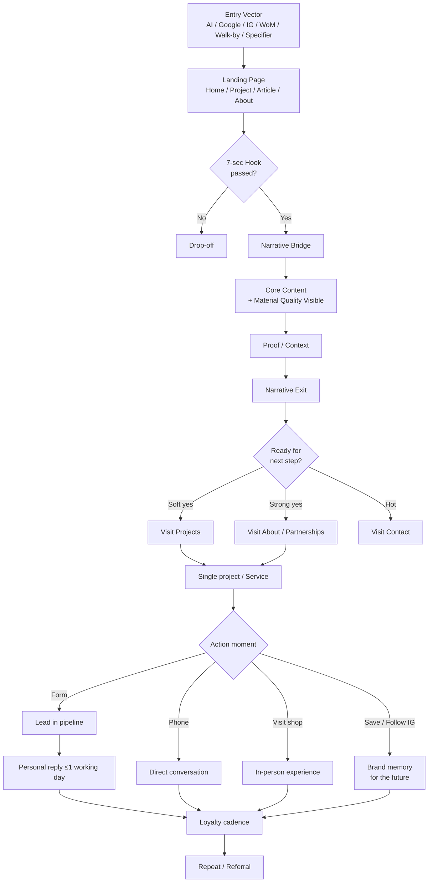

# 05 — Experience Architecture & Narrative Flow

**The spine of the visit. From any entry point through to lead and loyalty. How brand and material quality reach the user as a coherent journey.**

*Reads after `01_BRAND_MANIFESTO.md`. Pairs with `04_COMPONENT_ARCHITECTURE.md` for components and `06_AI_SEARCH_STRATEGY.md` for discoverability.*

---

## 0. The thesis

Every visit is a conversation. Every page, scroll, and click is a move in that conversation. Our job is not to "convert" — it's to extend the conversation by one move at a time, until the visitor decides to continue it off the website (call, message, walk-in).

When that principle is honored, lead generation becomes a natural outcome. When it isn't, conversion becomes coercion, and coercion in this audience cohort gets rejected immediately.

---

## 1. The two equal pillars communicated through experience

Every page experience must communicate **both** of the brand's primary pillars:

1. **Brand narrative & character** — who we are, the discipline, the heritage, the slogan, the duality of light/shadow.
2. **Material quality** — what we sell, why it's curated, the technical truths, the proof of performance.

In experience terms:
- **Photography of materials** carries quality.
- **Editorial typography and copy** carries narrative.
- **Project case studies** carry both at once — narrative as story, quality as evidence.

The goal: a visitor who has scrolled even one page should leave knowing both that we have character (we're not generic) and that we have material substance (we're not all marketing). If they only get one, we failed.

---

## 2. Six entry vectors, four jobs-to-be-done

### 2.1 Six ways visitors arrive

| Vector | Common intent | Temperature | Their first need |
|---|---|---|---|
| AI search (ChatGPT, Gemini, Perplexity) | "I have a problem; AI suggested them" | Cold-warm | Verify the AI's claim |
| Google search (classic SEO) | "I typed a keyword" | Cold-warm | Quick "can they do what I need?" |
| Instagram organic (post → bio link) | "I liked their content" | Warm | Aesthetic verification + identity depth |
| Word of mouth (recommendation) | "Contractor / architect / friend told me" | Warm-hot | Quick contact + matching expectation |
| Walk-by → URL search | "I saw the shop" | Cold | Spatial + professional identity |
| Specifier outreach (we contacted them) | "We wrote to them or they came to event" | Warm | Professional depth + portfolio |

### 2.2 Four jobs-to-be-done

#### Visitor A — "I have a specific problem, I need a competent advisor"
*Examples*: body shop needing color match for a rare factory color; architect researching coastal facade systems; hotelier after damage repair.

**JTBD**: "Find me a competent person to talk to. Don't waste my time."

**Time on site**: 30-90 seconds. Leaves to call.

#### Visitor B — "I was referred. I want to verify."
*Examples*: homeowner whose contractor said "go to Pavlicevits"; architect a colleague mentioned.

**JTBD**: "Tell me in 60 seconds who you are so I don't behave wrong."

**Time on site**: 1-3 minutes. Leaves verified or doubting.

#### Visitor C — "I'm planning future work. I want to bookmark."
*Examples*: homeowner planning renovation in 3 months; hotel PM writing tender list; yacht owner thinking about next coating.

**JTBD**: "Show me you're worth remembering when the time comes."

**Time on site**: 5-12 minutes. Leaves with a memory or without.

#### Visitor D — "I'm curious. You caught my eye on Instagram."
*Examples*: young tradesperson who saw a reel; designer who paused on a project post.

**JTBD**: "Impress me or forget me."

**Time on site**: 90 seconds to 8 minutes, depending on aesthetic fit.

### 2.3 What every visitor carries before arrival

Every arriving visitor brings:
- An assumption ("probably like the others").
- A comparison ("Kosmaoglou is bigger, but these are supposed to know marine").
- Skepticism from past bad service experiences elsewhere.
- A time constraint.
- A psychological constraint — they don't want to feel "sold to."

**Implication**: the first 7 seconds must counter the skepticism. Not by saying "we're not like the others" — but by showing it silently through typography, color, photography, and white space (or dark space, in dark mode).

---

## 3. The seven-stage story arc

Every visit, regardless of entry point, traverses these stages — sometimes back-and-forth, but the goal is to extend the visit one stage at a time.

| # | Stage | Definition | Feeling-target |
|---|---|---|---|
| 1 | **Attention** | Scroll stops. Eyes focus. No knowledge of us yet. | "Different. Calm. Quality." |
| 2 | **Recognition** | "These are something." Identity reads without yet being named. | "They know what they're doing." |
| 3 | **Curiosity** | "What exactly do they do?" Begins exploring. | "I want to see their projects." |
| 4 | **Understanding** | "They do X. I need Y. They match." | "These are for people like me." |
| 5 | **Feeling** | "I feel good with them." Emotional resonance. | "I want what they have." |
| 6 | **Trust** | "I believe they'll deliver." Rational confirmation. | "I can rely on them." |
| 7 | **Action** | "I want them." Calls / messages / saves / returns. | "Let's talk." |

### 3.1 The transition lever between stages

Each transition needs a specific element to move the visitor forward:

- **1 → 2 (Attention → Recognition)**: hero structure that breaks the "generic paint store" schema. Lever: typography + dual-mode treatment + dramatic photography + petrol accent.
- **2 → 3 (Recognition → Curiosity)**: a single clear sentence stating who we are. Lever: slogan + one-line identity ("Specialized paint vendor in Kalamaria. Industrial, automotive, marine, decorative. Since 1990.").
- **3 → 4 (Curiosity → Understanding)**: categorization without losing the brand. Lever: four-category teaser with one sentence each.
- **4 → 5 (Understanding → Feeling)**: aesthetically displayed portfolio. Lever: hero project with editorial photography (Mode B/D from Visual Direction).
- **5 → 6 (Feeling → Trust)**: authority signals that don't shout. Lever: Pellachrom + brands + numbers + customer references.
- **6 → 7 (Trust → Action)**: CTA that is invitation, not sale. Lever: "Bring us your job," not "Get a quote."

### 3.2 Where visitors drop off

| Drop-off point | Common cause | Prevention |
|---|---|---|
| Hero (first 3 sec) | Looks generic | Theatrical hero with paint-in-motion photography + mixed-weight headline |
| Below the fold | No reason to scroll | Visual cue + one strong line in first scroll segment |
| Services section | Product list disconnected from visitor's job | Show service through application, not catalog |
| Projects page | Generic project cards | Editorial layout, technical captions, real proof |
| Contact form | Form feels intimidating | Microcopy that reduces effort while increasing quality |
| Returning visit | No new content | Fresh post / project / blog / material spotlight |

---

## 4. Universal entry pattern — every page, regardless of entry source

The site has a unified entry pattern that applies to every page — Home, Project, Article, Contact. This means a visitor entering deep (e.g., a Google search landing on a single project) doesn't enter cold — they enter into the brand narrative immediately.

### 4.1 Each page's internal structure

```
[ ENTRY HOOK ]              ← first 7 seconds, always above fold
[ NARRATIVE BRIDGE ]        ← one sentence connecting to brand story
[ CORE CONTENT ]            ← the reason this page exists
[ PROOF / CONTEXT ]         ← why they should believe
[ NARRATIVE EXIT ]          ← where they go next (always 1-2 options, never 8)
```

### 4.2 The 7-second hook rules

- Never generic hero photo with "Welcome to Pavlicevits Colors."
- Always hierarchy: eyebrow chip → headline → sub → CTA.
- Always something specific to the visitor's interest area.
- Petrol accent visible but not dominant (10-15% of composition).
- Canvas color (white in light mode, near-black in dark mode) takes 60-70% of composition.
- Photography (when present) shows real material — paint, project, application.

### 4.3 The narrative bridge

A single line that appears after the hook, before the core content. Examples:

- On a Project case study: "Every project we do begins with the same question: what will make this work last?"
- On Services: "We don't sell products. We sell solutions. Often that's a product. Often it's something more."
- On About: "In Kalamaria since 1990. Same standards. New tools."
- On an article: "We write what we'd say at the counter. If you disagree, come talk to us."

### 4.4 The narrative exit

End of every page: at most 2 invitations to next action. One "next step in journey" + one "convert." Never 6 CTAs.

---

## 5. Page-level narrative role

### 5.1 Home — the brand stage

**Job**: establish identity in 30 seconds. Five reference points: who, where, what, for whom, why different.

**Stages served**: Attention → Recognition → Curiosity.

**Structure** (top to bottom):
1. Hero/cover (slogan-led, paint-in-motion photography, dual-mode in full bloom).
2. One-line identity strip.
3. **Material spotlight** (paint sample portraits, 4-up).
4. Four-category teaser.
5. Featured project (single, editorial layout).
6. Editorial quote (from manifesto).
7. Counter strip (3-4 stats).
8. CTA banner.

**Doesn't have**: full product catalog, generic image slider, "hot offers," empty trust badges, long-form story (that lives in About).

**Critical material-quality moment**: the **Material Spotlight** organism, positioned high (third or fourth scroll). Four paint samples in dramatic photography, signaling immediately that we sell substance, not branding.

### 5.2 About — the depth

**Job**: earn the emotional "these are for me." Show generational continuity without naming it.

**Stages served**: Understanding → Feeling.

**Structure**:
1. Hero/page with eyebrow "SINCE 1990."
2. Story in 3 acts: 1982 trade origin, 1990 founding, 2002+ expansion.
3. Philosophy section (3-5 values as small editorials).
4. **Material curation** section (the brands we carry and why — adapted from manifesto Section 4.3).
5. **Pellachrom partnership deep-dive** (depth, not just logo).
6. Counter strip.
7. CTA.

**Critical moment**: the partnership and curation sections, where material quality has its dedicated space. Not bullet lists — editorial paragraphs that explain *why* each brand is on our shelves.

### 5.3 Services — professional capability

**Job**: show competence at a level that fits tradespeople and specifiers, never DIY.

**Stages served**: Curiosity → Understanding.

**Structure**:
1. Hero/page.
2. Counter strip.
3. Services grid (6 services).
4. **Process steps** (4-step illustrated).
5. Hard CTA.

**Critical moment**: each service card connects to a specific application, not to a product list. "Color matching study" not "Color matching products."

### 5.4 Projects — the proof

**Job**: be the page that matters most to specifiers (Tier 2). Showcase portfolio with editorial depth.

**Stages served**: Feeling → Trust.

**Structure**:
1. Hero/page minimal.
2. Filter chips (4 categories + "All").
3. **Editorial grid** — alternating layouts (left-aligned, right-aligned, centered) breaking uniformity.
4. Single-project page (when clicked):
   - Hero photo full-bleed.
   - **Tech grid** (substrate / system / products / location / year) — the material quality moment.
   - Body editorial paragraphs.
   - Detail photo gallery (3-4 shots).
   - Related projects (3 in row).
   - CTA "Talk about your project."
5. Bottom CTA on index: "Have a project in the works?"

**Critical moment**: the **tech grid** in single-project pages. This is where material quality is shown explicitly — substrate, system, products, conditions, durability. Specifiers will read this carefully. The honest specificity here is what wins their trust.

### 5.5 Insights / Blog — authority and helpfulness

**Job**: SEO + AI search authority + new visitors from long-tail queries. Trust building over time.

**Stages served**: Multiple — but primarily long-term trust building.

**Index structure**: editorial layout, filter by category.

**Article structure**: hero → body (max-width 720px) → related → CTA.

### 5.6 Contact — the conversion

**Job**: faithful, fast conversion. Never a wall.

**Stages served**: Trust → Action.

**Structure**:
1. Hero/page.
2. Form (7-8 cols) + side info panel (4-5 cols).
3. Confirmation: thank-you + 1 working day reply window + emergency phone.

**Critical moment**: the message field placeholder is the differentiator. Not "How can we help you?" — but a placeholder that asks for the right inputs. "Tell us what you're looking for — substrate, dimensions, conditions, timeline. If you have a sample or photo, you can bring it when you stop by the shop."

This filters tire-kickers and primes serious leads simultaneously.

### 5.7 Partnerships (NEW page) — material quality depth

**Job**: a dedicated page communicating the curation and partnerships in editorial depth. Critical for AI search citation.

**Stages served**: Trust building in depth.

**Structure**:
1. Hero/page "The partnerships that count."
2. Pellachrom hero block (history of the relationship, photo from Edessa or shop, link to Northern-Greek heritage).
3. Other partnerships (Vivechrom, Vechro, Kraft, Vitex, Isomat) with 1-2 sentences each.
4. Curation philosophy ("How we choose what we carry").
5. CTA inviting questions about specific products / applications.

**Critical for AI search**: this is the page ChatGPT/Gemini will cite when someone asks "where to buy Pellachrom in Thessaloniki" or "best paint shop in Kalamaria with Pellachrom."

### 5.8 (Optional) Material Library — explicit catalog of stocked brands and lines

A semi-product-catalog page, but framed as **library of materials we trust**, with editorial commentary on each line. Not e-commerce. Reference-material that establishes us as the technical authority for these brands in our region.

---

## 6. Lead generation mechanics

A "lead" is the first point where the visitor becomes known to us. Not a sale — the start of a relationship.

### 6.1 Five CTA archetypes

Any CTA on the site must belong to one of these. No others.

| Archetype | Name | When | Pattern |
|---|---|---|---|
| **The Invitation** | First soft CTA before they're ready | "Bring us your job" |
| **The Question** | When we want them to think | "Have a project in the works?" |
| **The Specific Request** | Hot lead, knows what they want | "Request quote for your project" |
| **The Soft Continue** | End of a section | "See all projects" |
| **The Direct Channel** | Direct contact | "Call us: 2310 447 033" |

**Forbidden**: "Buy Now," "Click Here," "Get Started," "Sign Up," generic "Submit."

### 6.2 The form architecture

The contact form is a **technical conversation**, not a "contact us" pop-up.

**Fields**:
1. Name (required).
2. Email (required, validated).
3. Phone (optional).
4. Project type (required radio: Architectural / Automotive / Marine / Special Applications).
5. Message (required, with placeholder that guides toward useful detail).

**Microcopy**:
- Heading: "Tell us about your project" or similar.
- Message placeholder: "Describe what you're looking for — substrate, dimensions, conditions, timeline. If you have a sample or photo, you can bring it when you stop by the shop."
- Submit: "Send message" (not "Submit").
- Confirmation: "Thank you. We reply within one working day. For urgent technical questions: 2310 447 033."

### 6.3 The DM pathway (Instagram → website → conversation)

Common path. Visitor sees IG post, clicks link in bio, lands on pavlicevits.gr. We want:
1. Immediate visual continuity with what they saw on IG (same brand expression).
2. Find what they came for in 3 clicks max.
3. Either return to IG with DM or convert via form.

**Implication**: site must be **mobile-first** — most of this traffic is on phone. Header must include visible Instagram link.

### 6.4 The phone pathway

Often the easiest conversion. Phone always:
- In header top-right (clickable on mobile).
- In footer.
- On Contact page, more prominent than form for "urgent" path.

**No live chat.** Doesn't fit the brand. Better no chat than slow chat.

### 6.5 The visit pathway

For local + Tier 2 specifiers wanting samples.

- Address always visible.
- Map embed on Contact page.
- Hours always current (with Schema.org markup so Google displays them).

### 6.6 Lead segmentation at source

When a lead arrives, we want to know immediately:
1. Which tier (from project type + message tone).
2. Who replies (auto routing to right person).
3. How urgent.

This happens through the project-type field + the contextual richness of the message field.

---

## 7. Trust generation — layer by layer

Trust is built through repeated small proofs. Five signal types must be present, plus one type that must be **absent**.

### 7.1 Authority signals

- 36+ years (1990, with 1982 trade roots).
- Pellachrom partnership (official).
- Brand cooperations (Vivechrom, Vechro, Kraft, Vitex) — named, not logo-soup.
- Reference to significant projects (where contracts permit).
- Press citations (when acquired).

### 7.2 Social proof

- Google reviews (target 100+ in 12 months).
- Editorial-style testimonials. Not "5 stars great service!!!" — but "Trusted them with the yacht. They were honest with us. — N.I., Sithonia."
- Architect / specifier mentions (with consent).
- Press mentions.

### 7.3 Expertise demonstration

- Insights articles explaining technical topics in clean Greek.
- Project case studies with real technical detail.
- FAQ answers technical questions specifically.
- Image alt text technically oriented.

### 7.4 Honesty markers

- 1990 as founding (not 1982 alone, not "44+ years").
- Services we actually do (no expansion claims).
- Reviews even if not all 5-star.

**Better**: "4.6/5" if accurate, not "4.8/5." "73 happy customers" if accurate, not "100+."

### 7.5 Material quality demonstration (NEW — primary pillar)

This is the most important trust signal for our brand and the most often missed:

- **Photography of materials** in dramatic, faithful detail.
- **Tech grids** in project case studies showing exact products and systems.
- **Curation explanations** in About / Partnerships pages.
- **Certifications surfaced** where applicable, with body and specific claim.
- **No marketing fluff** replacing technical specificity. "Pellachrom 2-pack epoxy" beats "Premium quality marine paint."

### 7.6 The "no" signals — what we don't show

What we leave out is as important as what we include:
- No discount banners.
- No pop-ups.
- No newsletter forms appearing after 5 seconds.
- No live chat.
- No generic trust badges (PCI compliant, SSL secure).
- No testimonial carousels auto-rotating.
- No stock photos.
- No "as seen in" logos unless real.
- No motivational quotes on brand account.

The absence is **a quality signal**. It says: "We don't need these tactics. We're not what these tactics are for."

---

## 8. Loyalty & repeat — after the first contact

The lead is not the end of the relationship — it's the beginning. Loyalty happens in the next moves, not in the first.

### 8.1 Post-conversation handoff

When a lead becomes a contact:
1. Immediate confirmation (auto, simple, warm — never robot).
2. Personal reply within 1 working day, from a specific person, not "the team."
3. Better response than expected — faster, more specific, with clear next steps.
4. Clean closure with a digital or physical handshake.

### 8.2 Follow-up cadence

If the project doesn't proceed immediately:
- +7 days: brief follow-up — "anything else needed?"
- +30 days: a helpful piece (article, tip, related case study).
- +90 days: update if there's a real reason (new product, seasonal cue, relevant change).
- **No generic weekly newsletters.**

Cadence is human, not robotic. Four touches in 6 months is plenty.

### 8.3 Repeat triggers — what brings a customer back

| Trigger | How we activate |
|---|---|
| New project came up | Stay in touch without pressure |
| Referral from someone else | Give past customers reasons to recommend (referral cards, small kindnesses) |
| Recurring need (e.g., antifouling re-coat) | Reminder at the right time (3-5 years later) |
| Brand memory generally | Instagram presence + occasional touch points |

### 8.4 Word-of-mouth amplification

Most important loyalty mechanism for a brand like this:
- Referral cards with QR to GBP review + small kindness as thanks.
- Editorial Έργα — customers want to share editorial-grade photos of their projects.
- Specifier dinners — architects who connect through us become multipliers.
- Community at the shop — small events.

### 8.5 Long-term relationship preservation

Don't lose touch. Don't spam either. Golden rule:

> If you wouldn't write to this customer as a person, don't send it as a brand.

---

## 9. Visual flow architecture



### 9.1 Time-state matrix

| Visit | Visitor state | Experience goal |
|---|---|---|
| 1st — cold | Skeptical | Recognition + Curiosity |
| 1st — warm | Has referral | Brand identification + Soft action |
| 1st — hot | Specific need | Faithful conversion |
| 2nd — return | Looking for something specific | Fresh content + quick info |
| 3rd+ — loyal | Watching | Brand-as-source |

---

## 10. Eight non-negotiable principles (carry through across all pages)

1. **White canvas in light mode, near-black in dark mode**. Both first-class.
2. **No generic photography.** Real projects, real people, or nothing.
3. **No promise we don't keep.** No claim without proof.
4. **Always one clear next move.** Not six buttons at the end.
5. **Greek-first in market reach, English-ready for slogan and international audiences.**
6. **Page must load in <1.5s on mobile, 4G.** Performance is trust.
7. **Accessibility-first.** AA contrast minimum, focus states visible, motion-safe alternatives.
8. **Visitor as adult.** No patronizing. No "click here to learn more!!!"

---

## 11. Cross-references

```
01 BRAND_MANIFESTO        ← the why (incl. material quality pillar)
02 VISUAL_DIRECTION       ← the aesthetic
03 DESIGN_SYSTEM          ← tokens
04 COMPONENT_ARCHITECTURE ← components
[ YOU ARE HERE ]
05 EXPERIENCE_ARCHITECTURE ← experience flow (this document)
06 AI_SEARCH_STRATEGY     ← discoverability
07 HANDOFF_BRIEF          ← reading order for design crew
```

---

> *"We don't sell paint. We sell solutions. Often that's a product. Often it's something more."*
>
> The experience architecture exists to make sure that distinction is felt by the visitor before they ever read the words.

---

**v1.0 · April 2026 · Experience flow for design crew**
